# Post Event Report
The "Post Event Report" is a Communication Plan that once configured can be used to generate and send out a post-mortem style report once an event completes.  Some of the features are the ability to include the Properties, the ability to render something close to the original message in HTML, as well as statistics about the event itself (timestamps, duration, targeted recipients, resolved recipients, responders, and comments.

<kbd>
  
</kbd>

# Pre-Requisites
* xMatters account - If you don't have one, [get one](https://www.xmatters.com)!
* An xMatters User with the `Rest Web Service User` Role

# Files
* [PostEventReport.zip](PostEventReport.zip) - This is the Communications Plan that contains a Form for requesting/initiating the Report, as well as the Inbound Integrations, Outbound Integrations, and Shared Libraries that do the actual work.

# How it works
The report primarily takes advantage of two xMatters ReST APIs that do the majority of the work.  
The first one that is used for several purposes is the [GET /events](https://help.xmatters.com/xmapi/index.html?javascript#get-an-event) API.
We use GET /events for the following use cases:

1. Get the event details
    `GET /events/{eventID}?embed=properties,responseOptions,messages`
2. Get the targeted recipients
    `GET /events/{eventId}?embed=recipients&targeted=true`
3. Get the resolved recipients (the actually notified users) 
    `GET /events/{eventId}?embed=recipients&targeted=false`

Secondly we rely on the [GET /audits](https://help.xmatters.com/xmapi/index.html?javascript#get-event-audit-information) API.  This provides us the annotations (comments), as well as the Responses.  
    `GET /audits?eventId={eventId}&auditType=EVENT_ANNOTATED,RESPONSE_RECEIVED`

The process flow starts when the "Request Post Event Report" Form is initated/sent:  <kbd> 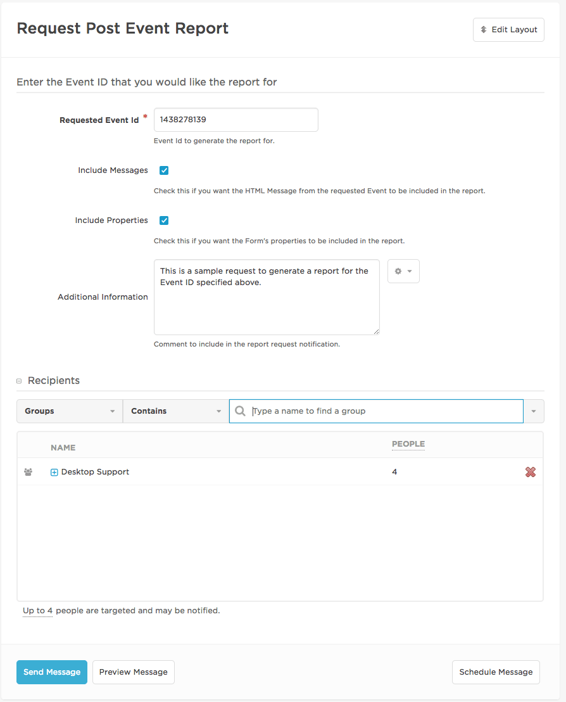 </kbd>  
This Form is the only visual part of the process.  It allows you to specify the Event ID of the Event to generate the report for, and users whom you want the report sent to when it is complete.  You also have the option of including or excluding the Properties form the Event, as well as the Messages from the Event.  

Upon sending this Form, the targeted recipients will recieve a confirmation notification letting them know to expect a Post Event Report in their inbox:
  <kbd> 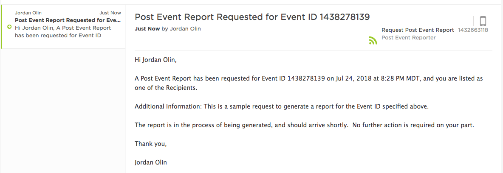 </kbd>  

Once the report request form is sent, an Outbound Integration is triggered with logic that only fires when this request becomes "ACTIVE".  At that point, it calls the Inbound Integration that represents the first of five steps (four for collecting data, and one for formatting and generating the report).  At the end of step 5, the Form called "Post Event Report" is initiated with the results and sent to the users that were identified when the "Request Post Event Report" was sent.

The following three images are an example of the Post Event Report generated for the Event Id specified in the request:
 <kbd> 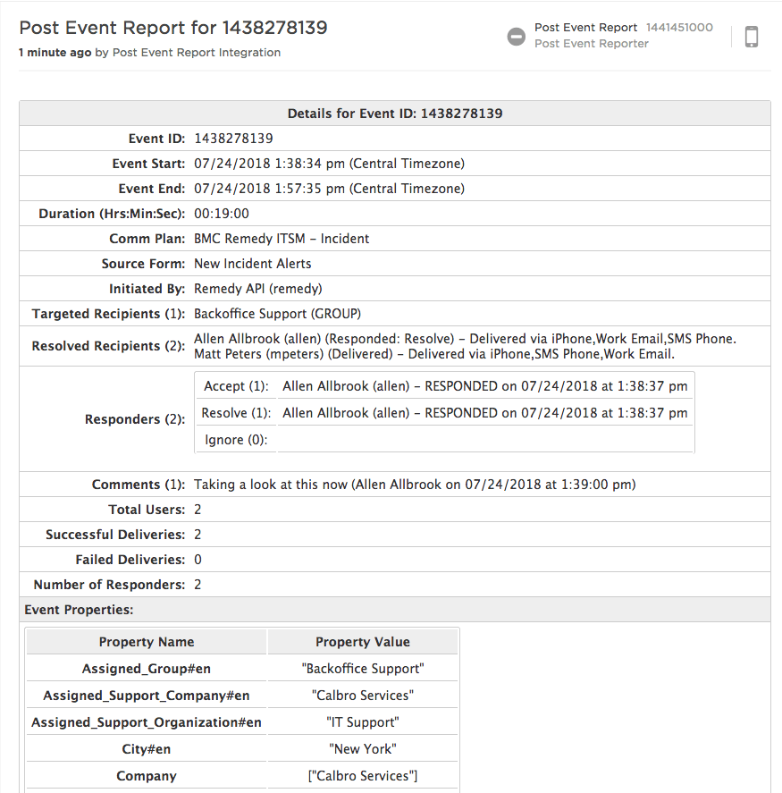 </kbd> 
 <kbd> 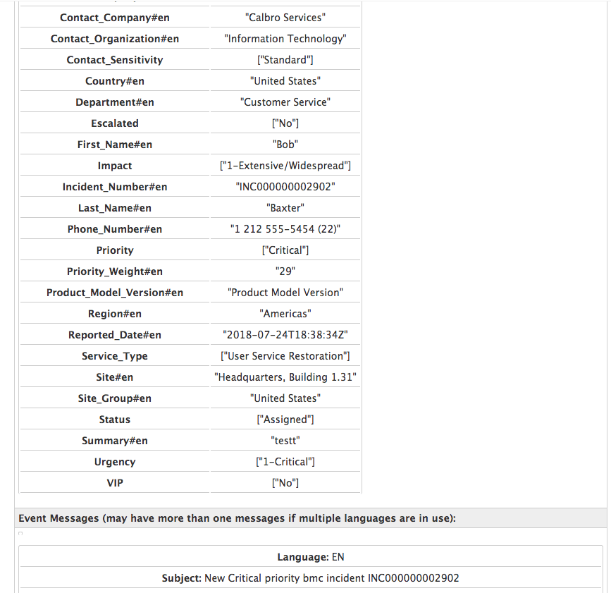 </kbd> 
 <kbd> 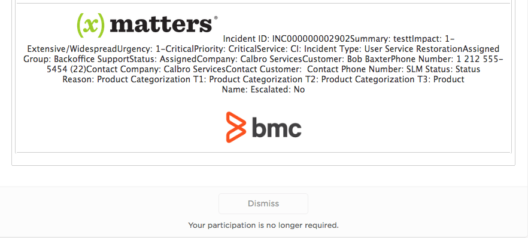 </kbd> 

Within the Commmunication Plan are two Shared Libraries that were created to encapsulate the work done during each phase.  There is one Shared Library for requesting the report (`Post Event Client`), and another for creating the report (`Post Event Reporter`).  In theory you could install the `Post Event Client` library and it's pre-requisite endpoint and contants (documented in the `Post Event Client` Shared Library source) in any Communications Plan.

# Installation

## xMatters set up
### Import the Communication Plan
First, i\mport the `Post Event Report` Comm Plan into xMatters by downloading the [PostEventReport.zip](PostEventReport.zip) file and logging into xMatters. Navigate to the Developer tab and click the `Import Plan` button. 

<kbd>
  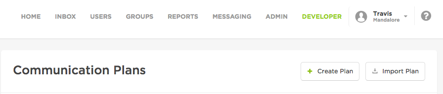
</kbd>

Point to the `PostEventReport.zip` file and click Import Plan. This will create the `Post Event Report` Comm Plan.

### Create a REST user account
* **First Name:** Integration
* **Last Name:** PER
* **User ID:** rest.per
* **Roles:** REST Web Service User

### Assign permissions to the Communication Plan, Form, and Endpoint  
1. **Communication Plan**  
    * From within the Developer tab, select the Edit drop-down menu for the Post Event Report communication plan
    * From the Edit drop-down menu, select Access Permissions
    * From within Access Permissions, add the xMatters REST User created above `rest.per`

2. **Forms**  
    * From within the Developer tab, select the Edit drop-down menu for the Post Event Report communication plan
    * From the Edit drop-down menu, select Forms
    * From within Forms, select the "Web Service" drop-down menu for the `Post Event Report` Form
    * From within "Web Service" drop-down menu, select Sender Permissions
    * From within Sender Permissions, add the xMatters REST User created above `rest.per`
    * Again, from within Forms, select the "Web UI, Mobile" drop-down menu for the `Request Post Event Report` Form
    * From within "Web UI, Mobile" drop-down menu, select Sender Permissions
    * From within Sender Permissions, add the Roles that you would like to enable to request that the reports are generated.  You may want to consider `Company Supervisor`, `Developer`, and/or `Support User`.

3. **Generate API Key for Inbound Integration**  
    * There is an Inbound Integration that is used to start the Report Generation process called `PER Step 1: Initiate Post Event Reporter`.
    * You need to generate the <b>API Key</b> and <b>Secret</b> for this Inbound Integration.
    * This will be used to configure one of the Endpoints below.
    * To configure the API Key, open the Inbound Integrations section of the Comm Plan (from the Integration Builder section) and select the `PER Step 1: Initiate Post Event Reporter`. 
    <kbd> 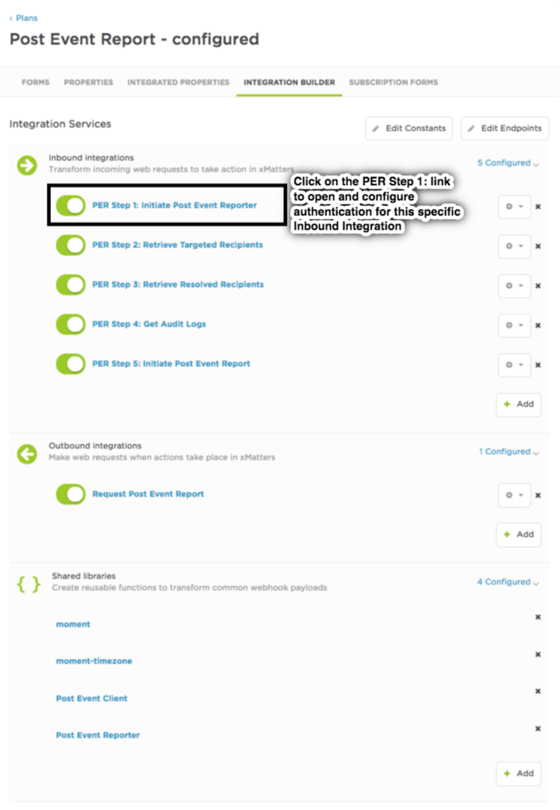 </kbd>
    * Next set the API Key based on the selected user.  Choose `rest.per` for the user.
    <kbd> 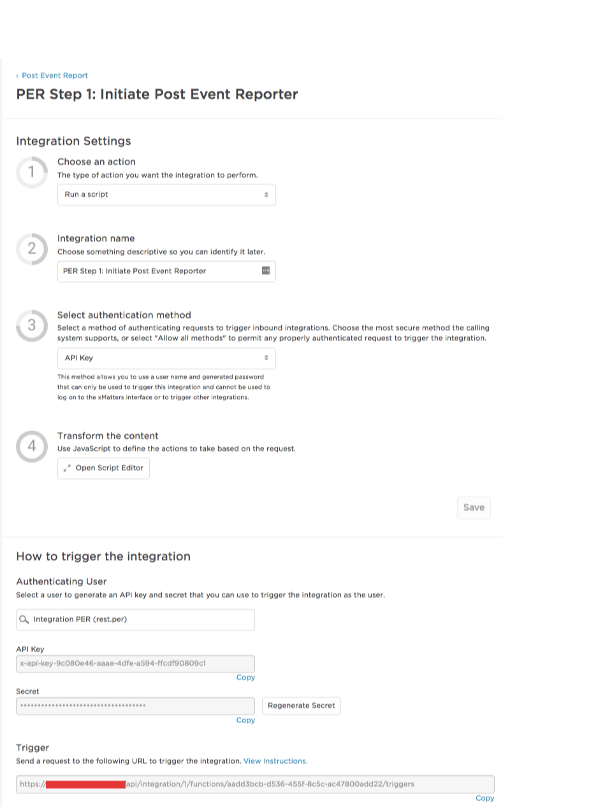 </kbd>
    * Copy the following three items as you will need them later:
        1. API Key (Will be used to configure the `PEC Collector` endpoint.)
        2. Secret (Will be used to configure the `PEC Collector` endpoint.)
        3. Trigger  (Will be used to configure the `PEC_INBOUND_INTEGRATION_URL` constant.)

4. **Collect the Inbound Integration Triggers for Steps 2 through 5**
    * Staying in the Inbound Integration section, go into the remaining four Inbound Integrations, and capture the Trigger for each as they will be needed when configuring the Constants below.
    1. `PER Step 2: Retrieve Targeted Recipients`
    2. `PER Step 3: Retrieve Resolved Recipients`
    3. `PER Step 4: Get Audit Logs`
    4. `PER Step 5: Initiate Post Event Report`

5. **Endpoints**  
    * There are two Endpoints that need to be configured.
    * One is used by the Request phase whereby it initiates the report by calling the Inbound Integration for Step 1; `PEC_COLLECTOR`.
    * The second is used by the Report Generation logic, and is called `PER _REPORTER`.
    * To get to this area, from the Edit drop-down menu, select Integration Builder
    * From within the Integration Builder tab, select Edit Endpoints
    * From within Edit Endpoints, select and configure `PEC_COLLECTOR` and `PER_REPORTER` in turn.
    * The `PEC_COLLECTOR` must be configured to point to your xMatters Instance, with Basic Auth, and specify the <b>API Key</b> and <b>Secret</b> from Step 3.1 and 3.2 above as the User and Password.
        <kbd>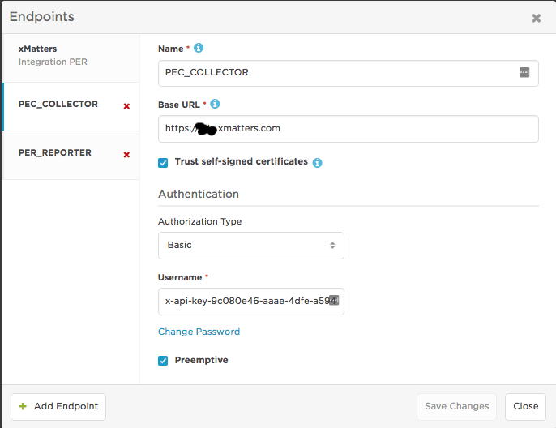</kbd>
    * The `PER_REPORTER` endpoint should be configured with Basic Auth and specify the `rest.per` user created previously.
        <kbd>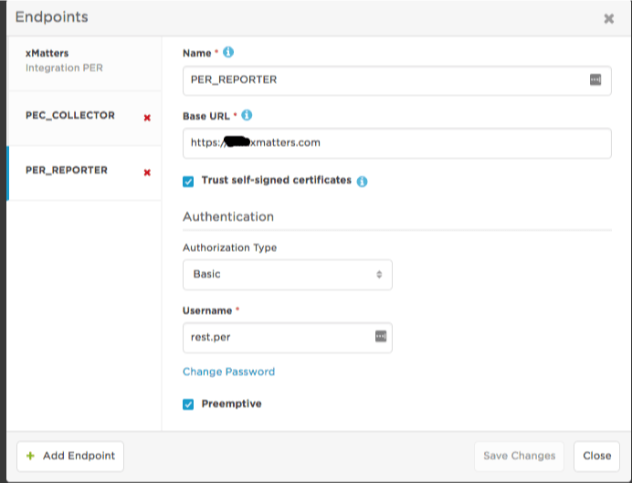</kbd>

5. **Constants**  
    * There are serveral constants defined in the Communication Plan, but only two need to be modified to finish the configuration:
        * `PEC_INBOUND_INTEGRATION_URL`
        * `PER_STEP_URLS`

    *  To get to this area, from the Edit drop-down menu, select Integration Builder
    * From within the Integration Builder tab, select Edit Constants
    * `PEC_INBOUND_INTEGRATION_URL` is the relative URL to the Inbound Integration that starts `PER Step 1: Initiate Post Event Reporter`.  Copy everything frome `/api` forward from above.
        <kbd>  </kbd>

    * `PER_STEP_URLS` contains a JSON array of relative URLs that map to Steps 2, 3, 4 and 5.
        <kbd>  </kbd>

    * Some other interesting constants that you may need to adjust have to do with the formatting of date/time values.  In particular the timezone used for time/date calculations is specified in `PER_TIMEZONE` and the displayable version is in `PER_TIMEZONE_DISPLAY`.

# Running
If you have set the permissions correctly, you should be able to go to the Messaging tab and see on the left side the `POST EVENT REPORT` Communication Plan heading and the `Request Post Event Report` Form available to execute.
<kbd>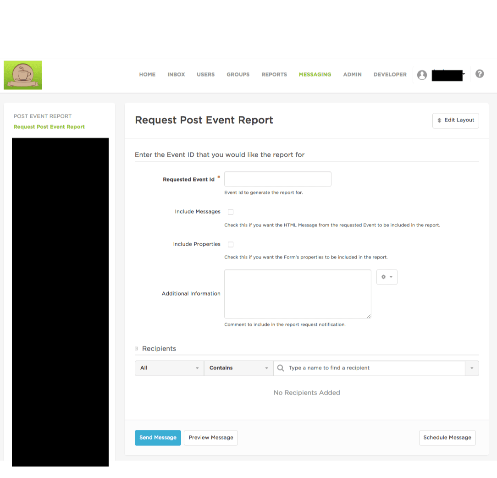</kbd>

# Caveats
There are a few items to consider that can determine whether or not the report will be able to be completed.  This report cannot handle massive amounts of data (e.g. 15000 users).  
The Integration Builder has some limitations on processing time such that any step must complete within 60 seconds.  
So, if you choose an Event that simpley never generates a report, it is probably because either the processing time was exceeded (not something we can detect or prevent), or you have too many properties (the report can handle a combined set of properites up to 100K).  
If you try the report and it does not complete, try again but deselect the `Include Properties` and `Include Messages` options and see if that helps.

Finally, if you get stuck, open up an Issue via this specific GitHub Repository and we will take a look. 